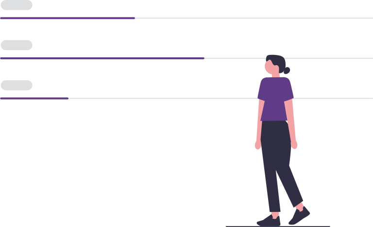
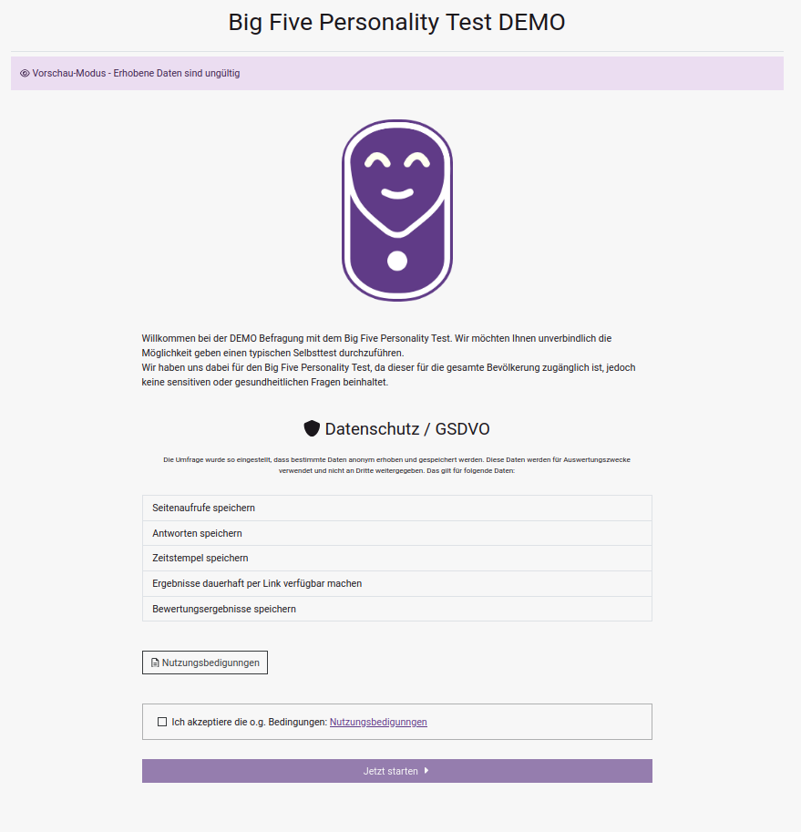
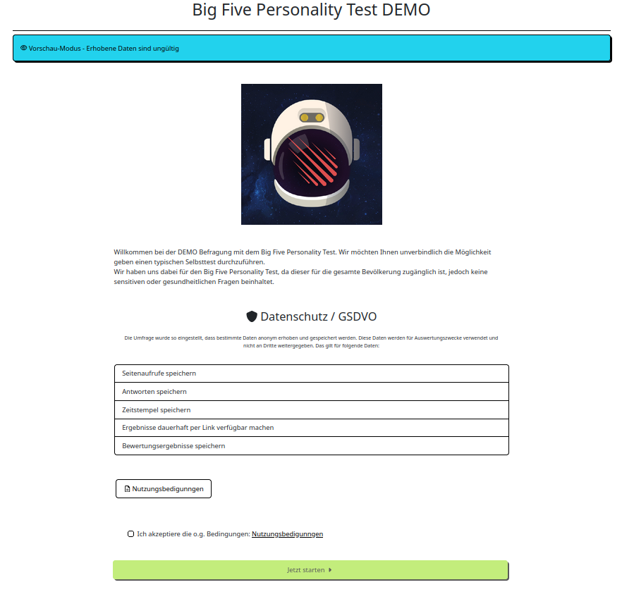
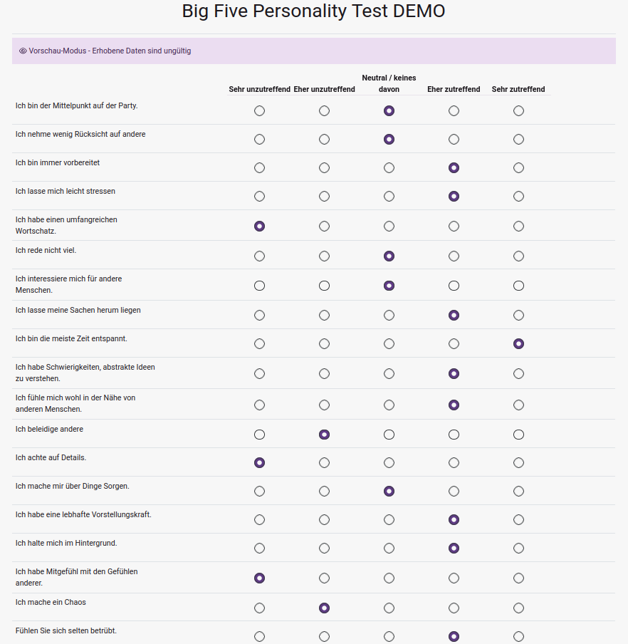
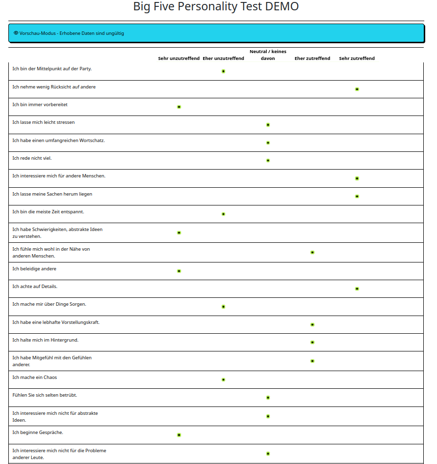

## Wie funktioniert die Selbsttest-App?

## Was unterscheidet die Selbsttest-App von anderen Online-Befragungen?

Mit der Selbsttest-App können Sie zu Ihrer Befragung eine Zielgruppen-gerechte Rückmeldung dynamisch
auf Basis der Antworten erstellen.
Dies ermöglicht es Ihnen z.B. gängige valide Fragebögen mitsamt der Auswertung Ihrer Zielgruppe anonym 
zugänglich zu machen.
Teilnehmehmende Personen erhalten die Rückmeldung unverzüglich nach Befragung und können so entsprechende Folgemaßnahmen ergreifen.

## Welche Daten werden erhoben und gespeichert?

Ein wesentlicher Aspekt der Selbsttest-App ist der hohe Datenschutz: 
es werden grundsätzlich keine Personenbezogenen Daten erhoben.

Zudem lassen sich Befragungen flexibel an die lokalen Datenschutzanforderungen, bis hin zu vollständig anonysierten
Befragungen anpassen.

## Kann ich mein eigenes Design verwenden?

Mit dem [Business Plan](./pricing.md) können Sie eigene Designs in Form von "Themes" verwenden.
Dabei sind Sie vollkommen Flexibel in Ihrer Gesaltung der Elemente.

|                            Standard                            |                            Custom                            |
|:--------------------------------------------------------------:|:------------------------------------------------------------:|
|  |    |
|   |    |

  <small><i>Vergleich Standard Design (links) vs. customisiertes Design (rechts)</i></small>

## Weitere Informationen

- [Kostenübersicht](./pricing.md)
- [Datenschutzerklärung Webseite](./privacy.md)
- [Datenschutzerklärung Selbsttest-App](./privacy-app.md)
- [Nutzungsbedingungen Selbsttest-App](./terms.md)

## Sie haben noch Fragen?

Zögern Sie nicht uns unverbindlich via kontakt@selbsttest.org zu kontaktieren.

